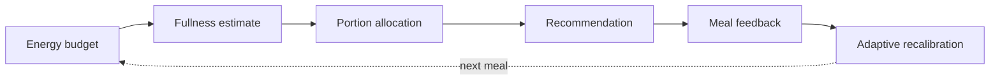

# justseven-core

A **dependency-free, pure TypeScript, production-derived dietary recommendation core** extracted, de-identified, and rewritten from [justseven-app](https://github.com/9-71/justseven-app). It exposes reusable, testable algorithms; it is not the complete application source.

The package has no runtime dependencies. It accepts plain data and does not depend on `wx.*`, cloud services, or the DOM.

## Why this library

Recommending how much of a meal to eat is a control problem. A useful suggestion depends on the meal, the person, and past feedback. The core addresses four questions:

1. **Energy budget:** What is a reasonable target for this meal, based on BMR and a weight goal?
2. **Fullness:** How do the meal's energy and macros relate to a target fullness score?
3. **Portion allocation:** Which dishes should be reduced, while respecting category-specific floors?
4. **Adaptation:** How should reported intake and satiety change a later recommendation?

The caller composes these algorithms with its own meal data and application workflow.

## Relationship to justseven-app

[justseven-app](https://github.com/9-71/justseven-app) is the main WeChat Mini Program, with application UI, meal recording and interaction flows, cloud persistence, and AI-assisted meal analysis. This repository publishes only a reusable algorithm core derived from that work. Mini Program UI, `wx.*` and cloud integrations, DOM code, production food data, and application-level logic are excluded. The six dishes in `mockFoodData` are illustrative test and demo data, not a production database.

## Algorithm flow



The exports cover BMR and meal targets (`bmr`), fullness regression and portion quotas (`hfs`), optional plate geometry and macro estimation (`geometry`), and Bayesian feedback calibration (`bayesian`). Dialog, pet-state, and feedback-turn helpers are also exported. There is no single exported function that runs the whole diagram; the caller supplies inputs, chooses the target, and persists calibration state.

## Quick Start

```bash
npm ci
npm run build
npm test
npm run demo
```

`npm run build` compiles the TypeScript library to `dist/` with declarations. `npm run demo` runs the included feedback simulation. From the repository root, import the public source entry point as shown below. An installed package can instead be imported as `justseven-core`.

```ts
import {
  calcBMR,
  computeMealBudget,
  computeRecommendedRatio,
  allocateFlexibleQuota,
  createInitialState,
  calibrateAfterMeal,
  applyCalibration
} from './src';
import type { MacroSummary, QuotaInput } from './src';

const bmr = calcBMR({ gender: 'male', age: 28, height: 175, weight: 70 });
const targetKcal = computeMealBudget(bmr, 'maintain');

// Supply whole-meal macros and per-dish energy from your own data source.
const macros: MacroSummary = { totalKcal: 900, proteinG: 35, fiberG: 8, fatG: 28 };
const items: QuotaInput[] = [
  { id: 'rice', kcal: 300, category: 'carb' },
  { id: 'chicken', kcal: 200, category: 'protein' },
  { id: 'fried', kcal: 400, category: 'fried' }
];

const { rBase } = computeRecommendedRatio(targetKcal, macros.totalKcal, macros);
const quota = allocateFlexibleQuota(items, Math.min(rBase, 1) * macros.totalKcal);
const currentKeep = quota.keepById.rice;

// After this meal, retain the returned state for the next feedback update.
const updated = calibrateAfterMeal(
  createInitialState(),
  { theta: 1.1, F: 0, recordedAt: Date.now() }
);
const nextKeep = applyCalibration(currentKeep, updated.result.factor);
```

`theta` is actual intake divided by the recommended amount; `F` is `-1` (not full), `0` (target fullness), or `1` (too full). `nextKeep` illustrates how the new factor can adjust a later recommendation for the same dish. Real applications must store `updated.state` and pass it into the next `calibrateAfterMeal` call. `allocateFlexibleQuota` accepts an energy target; the example derives one from the fused energy/fullness ratio. It can report `shortfallKcal` if category floors prevent the requested reduction.

## Algorithms

### BMR and meal budget

**Problem:** Establish a meal energy reference from a person's profile.

**Input → output:** `calcBMR` takes gender, age (years), height (cm), and weight
(kg), returning kcal/day. `computeMealBudget(bmr, goal)` returns kcal for `lose`, `maintain`, or `gain`.

$$
\mathrm{BMR}=10w+6.25h-5a+s,\qquad s=5\ (\text{male}),\ -161\ (\text{female})
$$

$$
E_{\mathrm{base},m}=\mathrm{BMR}\times G\times\mu_m,
\qquad \mu_m=0.32\ \text{by default}
$$

`G` defaults to 0.85, 1.0, or 1.15 for the three goals. Two **distinct target
policies** are available: `computeMealCalorieBaseline` returns a 0.7-scaled
target; `computeMealTargetBand` returns a goal-adjusted target with a ±5% band
capped at 100 kcal total width. The caller chooses the policy.

### HFS dual-constraint recommendation

**Problem:** Balance energy and fullness, then assign per-dish keep ratios.

**Input → output:** `computeRecommendedRatio(targetKcal, totalKcal, macros)`
uses plate energy, protein, fiber, and fat to return `rE`, `rH`, and `rBase`.
`allocateFlexibleQuota(items, targetKcal)` takes dish IDs, kcal, and categories;
it returns `keepById`, `reducedKcal`, `shortfallKcal`, and `capped`.

$$
r_H=\mathrm{Clip}\!\left(
\frac{HFS^*-\beta_0}{\beta_1E+\beta_2P+\beta_3F_b-\beta_4F_t},
r_{\min},r_{\max}\right)
$$

$$
r_{\mathrm{base}}=(1-\alpha)r_E+\alpha r_H,
\qquad r_E=E_{\mathrm{target}}/E_{\mathrm{total}}
$$

The fullness term is a linear macro regression; defaults are `HFS* = 7` and
`α = 0.5`. The allocator cuts toward the **caller-supplied energy target**,
weighting dishes by kcal and category cut pressure. It redistributes cuts at
category floors and reports any shortfall. `computeDynamicTarget` can adjust a later target from recent fullness scores.

### Bayesian adaptive calibration

**Problem:** Adjust later advice from feedback without overreacting to one meal.

**Input → output:** `calibrateAfterMeal(state, feedback)` accepts a
`CalibrationState` and `{ theta, F, recordedAt? }`; it returns the updated
state, observation, gain, and result. `applyCalibration` scales a later ratio.

$$
y_t=\theta_t(1-\lambda F_t),\qquad F_t\in\{-1,0,+1\}
$$

$$
K_t=\frac{s_t^2}{s_t^2+\tau^2},\qquad
m_{t+1}=m_t+K_t(y_t-m_t),\qquad
s_{t+1}^2=(1-K_t)s_t^2
$$

Here `theta` is actual intake divided by the recommendation. The posterior
mean supplies a bounded factor; variance shrinks as feedback accumulates.
The default factor is clipped to `[0.8, 1.2]`. A ±0.05 hysteresis band stabilizes
the `up`/`hold`/`down` verdict. Store the state outside this library.

### Plate geometry estimation

**Problem:** Estimate component masses and macros when weights are unavailable.

**Input → output:** `estimateMasses` takes category, normalized bounding box,
and optional mass prior per component; it returns masses with a `vlm` or
`density` source and volume shares. `estimateMacros` returns kcal, protein, fiber, and fat from category and mass.

$$
V_i=K_i\,A_i\,H_i,\qquad \omega_i=V_i/\sum_jV_j
$$

$$
M_i=M_{\mathrm{ref}}\,\omega_i\,\rho_i/\bar\rho
$$

`A_i` is area share; category form factors supply `K_i`, `H_i`, and density
`ρ_i`. A mass prior in `[50, 500]` g is used directly; otherwise the fallback
uses a 450 g reference plate. Densities are illustrative. Image recognition
and rendering remain outside this package.

### Hyperparameters and configuration

| Setting | Shipped default | Role |
| --- | --- | --- |
| `HfsConfig.betas` | `3.0, 0.003, 0.05, 0.08, 0.03` | Fullness regression coefficients |
| `HfsConfig.hfsStar / fusionAlpha` | `7 / 0.5` | Fullness target and energy/fullness blend |
| `HfsConfig.rMin / rMax` | `0.3 / 1.3` | Fullness-ratio bounds |
| `HfsConfig.tiers` | Category-specific | Cut pressure and minimum keep ratio |
| `BayesianConfig.lambda / tauSq` | `0.08 / 0.2` | Satiety adjustment and observation noise |
| `BayesianConfig.cMin / cMax` | `0.8 / 1.2` | Calibration-factor bounds |

`resolveHfsConfig` and `resolveBayesianConfig` supply optional defaults; each API
accepts its own options. Shipped coefficients, densities, and calibration settings are illustrative:
fit and validate them for your deployment.

## Testing

`npm test` runs Vitest. The current suite has **94 tests in six files**, covering BMR and meal budgets, fullness and quota allocation, Bayesian feedback, geometry, feedback/dialog and pet-state behavior, and mock data. `npm run build` checks the library's TypeScript compilation. Tests use the included mock data; they do not exercise the SevenFull application or its cloud services.

This library does not provide medical or clinical nutrition advice.

## License

Released under [CC BY-NC 4.0](./LICENSE). Commercial use requires a separate license from the authors.
